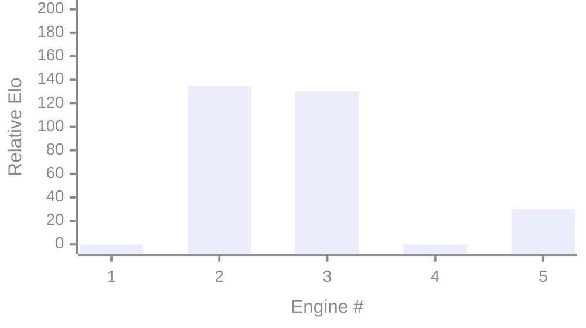

## Patchwork

An informal cumulative and comptitive frontier LLM eval using a Javascript chess engine.

| Engine          | Model                       | CLI         | SPRT | ~Elo | Notes                | 
|-----------------|-----------------------------|-------------|------|------|----------------------| 
| [0005_opus_4_7](engines/0005_opus_4_7.js)     | Anthropic Claude Opus 4.7   | Claude Code | Pass | +30  | Leader               | 
| [0004_gpt_5_5](engines/0004_gpt_5_5.js)       | OpenAI GPT 5.5              | Codex       | Fail |      |                      |
| [0003_opus_4_7](engines/0003_opus_4_7.js)     | Anthropic Claude Opus 4.7   | Claude Code | Pass | +130 |                      | 
| [0002_sonnet_4_6](engines/0002_sonnet_4_6.js) | Anthropic Claude Sonnet 4.6 | Claude Code | Pass | +135 |                      | 
| [0001_haiku_4_5](engines/0001_haiku_4_5.js)   | Anthropic Claude Haiku 4.5  | Claude Code | Fail |      |                      | 
| [0000_original](engines/0000_original.js)     |                             |             |      |      | Boot engine          | 
 
See the ```engines``` dir for each engine source.

Models are given the chance to improve the currently leading engine to become the new leader using ```prompt.md```. The resultant engine is then evaluated by a [0,5] SPRT against the leading engine. 



The boot engine was around 1800 Elo.
