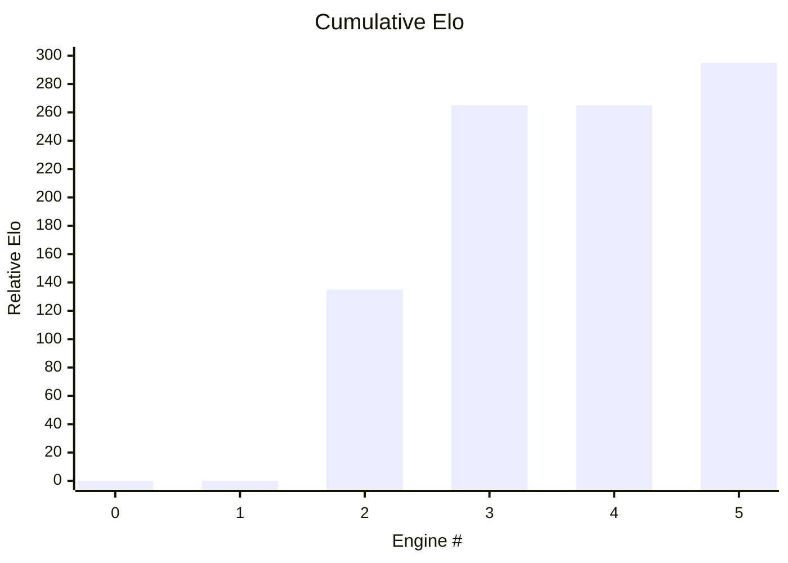

## Patchwork

An informal cumulative and comptitive frontier LLM eval using a Javascript chess engine.

| Engine          | Model                       | CLI         | SPRT | ~Elo | Notes                | 
|-----------------|-----------------------------|-------------|------|------|----------------------| 
| 0005_opus_4_7   | Anthropic Claude Opus 4.7   | Claude Code | Pass | +30  | Leader               | 
| 0004_gpt_5_5    | OpenAI GPT 5.5              | Codex       | Fail |      |                      |
| 0003_opus_4_7   | Anthropic Claude Opus 4.7   | Claude Code | Pass | +130 |                      | 
| 0002_sonnet_4_6 | Anthropic Claude Sonnet 4.6 | Claude Code | Pass | +135 |                      | 
| 0001_haiku_4_5  | Anthropic Claude Haiku 4.5  | Claude Code | Fail |      |                      | 
| 0000_original   |                             |             |      | 1800 | Boot engine          | 
 
See the ```engines``` dir for each engine source.

Models are given the chance to improve the currently leading engine to become the new leader using ```prompt.md```. The resultant engine is then evaluated by a [0,5] SPRT against the leading engine. 


